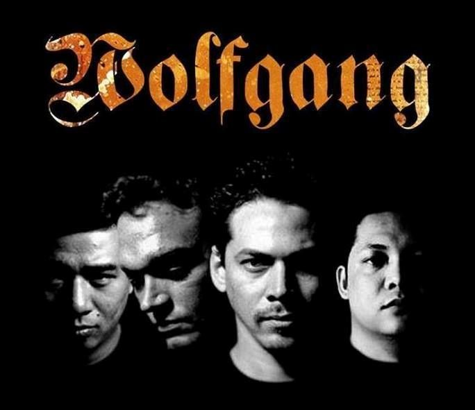

# Gohetia_Zhang_HW1
This is the repo for our HW1
# Gohetia Sheldon & Zhang Chuhan
## Gohetia Sheldon
### **Hobbies** ###
- Playing video games - streaming online with my favorite video games.
- Playing guitar - I always love playing guitar. Shredding some solo guitar lead from old music bands.
- Dancing - expressing my emotions through dancing.

### **Favourite Movies** ###
- Tears of the Sun
- The Matrix

### **Favourite Anime Series** ###
- Naruto Shippuden
- Shingeki No Kyojin
- Tokyo Ghoul
- Jujutsu Kaisen

### **Culture** ###
I am from Southern Leyte, Philippines. Country that is rich in natural resources and beautiful beaches.

### **Favourite Disheses** ###
*Kinilaw na Isda*

*Tuyom* - sea orchin

### **Favourite Filipino Grindcore band** ###
*Wolf Gang*

### **Looking forward to:** ###
- become a Frontend or Backend developer here in Canada.
- become an Animator.
- become a motion and graphics designer.
---
## Zhang Chuhan
### **Hobbies**
- Singing in koraoke
- kpop dance
- Watching chinese tv drama

### **Culture** 
I'm from the city of Shenyang which is located in the northeastern of China. Shenyang once used to be the capital city of the country in Qing dynasty hundreds of years ago.

### **Favorite Chinese Food** 
*spicy hotpot*

*tanghulu*

### **Looking forward to**
- find what I'm really interested in through this program
- maybe make some friends and get used to speaking English
---
## Installation

No installation required

## Usage

Thank you for taking time reading our favourites and hobbies!

## Contributing

1. Fork it!
2. Create your feature branch: `git checkout -b my-new-feature`
3. Commit your changes: `git commit -am 'Add some feature'`
4. Push to the branch: `git push origin my-new-feature`
5. Submit a pull request :D

## History

Winter, January 2024

## Credits

Sheldon Gohetia

Chuhan Zhang

## License

MIT

